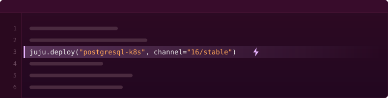

# jubilant-prewire — Test your charm, not your patience

jubilant-prewire is an **experimental** plugin for [Juju charm](https://canonical.com/juju/charms-architecture) integration tests. It modifies Jubilant's [`deploy()`](https://canonical.com/juju/docs/jubilant/reference/jubilant/#jubilant.Juju.deploy) method to pre-pull OCI images before calling the Juju CLI, so timeouts tell you about real problems instead of slow image pulls.



## Usage

Add jubilant-prewire as an integration testing dependency of your charm:

```text
uv add --group integration git+https://github.com/dwilding/jubilant-prewire@main
```

Then run the integration tests as normal.

## How jubilant-prewire works

jubilant-prewire is a pytest plugin that modifies Jubilant's `deploy()` method. When `deploy()` sees a charm from Charmhub, the plugin queries Charmhub for the location of the charm's OCI image, then pulls the image into the container runtime. The plugin then runs `juju deploy` as normal. When Juju starts the charm's container, the image is already in place, so the container starts without waiting on the network.

Bundles are expanded. The plugin reads the bundle's YAML, finds each Charmhub charm, then pulls all images in parallel before asking Juju to deploy the bundle.

jubilant-prewire assumes the Kubernetes environment was set up with [Concierge](https://canonical.com/juju/docs/concierge/), and that Concierge installed [Canonical Kubernetes](https://ubuntu.com/kubernetes/documentation). MicroK8s is not currently supported.

The plugin probes known locations for the containerd socket. If no containerd socket is found, the plugin reverts to the default behavior of `deploy()`. Similarly, if Charmhub is unreachable or an image pull fails, the plugin abandons the pre-pull and runs `juju deploy` as normal.

From the perspective of the integration tests, `deploy()` is functionally unchanged; it just takes longer to return. A failed pre-pull never fails a test.
